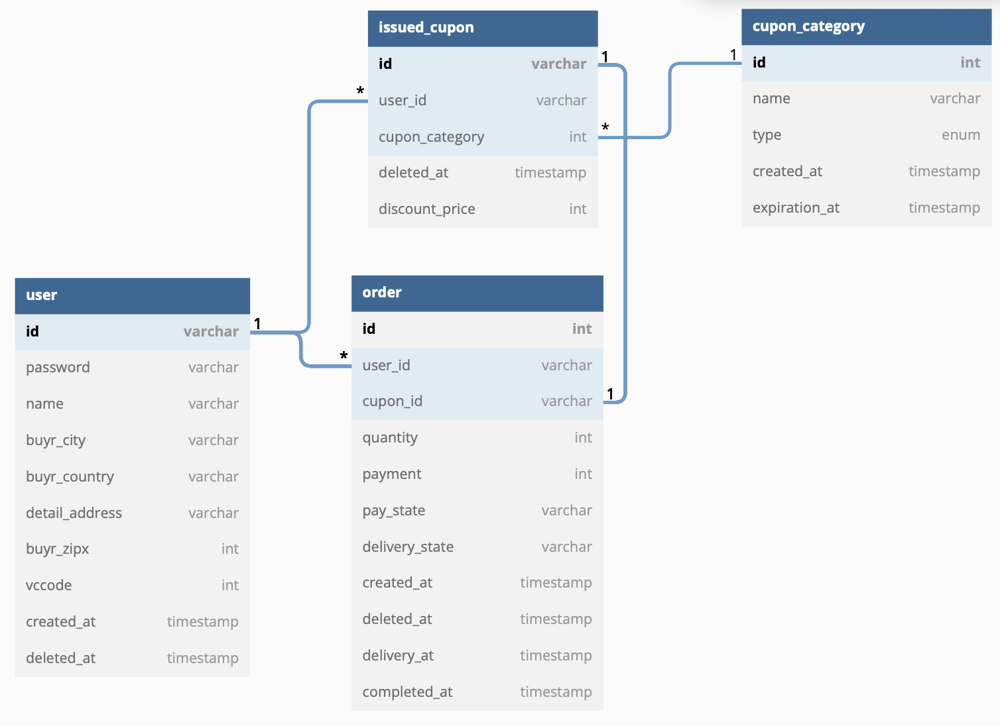

# Cupon Management Service

쇼핑몰의 쿠폰 발급 및 관리 서비스입니다.

제품은 1가지라고 가정하며, 특징은 다음과 같습니다.

<br>

### 1. 배송비

국가 및 주문 개수에 따라 배송비가 다릅니다. 환율은 1200원을 따릅니다.

<br>

### 2. 쿠폰

배송비, % 할인, 정액할인 3가지 종류의 쿠폰이 있습니다.

관리자는 쿠폰 타입을 등록 및 발급할 수 있습니다.

<br>

### 3. 배송

관리자는 배송 상태를 배송중, 배송완료 등으로 변경할 수 있어야 합니다.

</br >
</br >

## 목차

---

[분석 및 설계](#분석-및-설계)

[테스트 방법](#테스트-방법)

[API 명세](#api-명세)

<br >
<br >

## 분석 및 설계

---



<br>

### 1. 사용자 테이블

#### 1.1 주소 관련 데이터를 이전

제시받은 데이터에는 order(주문) 테이블 내에 주소 관련 필드가 포함되어 있지만, 사용자 테이블을 별도 생성하여 안에 넣는 것이 논리적으로 이해하기 쉽다고 판단하여 따로 생성하였습니다.

### 1.2 주소록 테이블?

실제 쇼핑몰처럼 한 사용자가 여러개의 주소를 가질 수 있게 address(주소록) 테이블을 따로 설계하려 하였으나 이 부분은 주요 서비스가 아니므로 사용자 정보에 하나의 주소 데이터를 넣을 수 있게 최종 설계하였습니다.

<br >

### 2. 쿠폰 시스템

쿠폰 타입 신설과 쿠폰 발급 두가지 과정을 다음과 같이 나누었습니다.

- 쿠폰 타입 신설 : 이름, 만료기간, 타입을 입력하여 신설

- 쿠폰 발급 : 생성해둔 타입의 쿠폰을 모든, 또는 특정 사용자에게 발급

ex)
'추석맞이 배송비 무료 쿠폰'을 '배송비' 타입의 쿠폰으로 만료기간 '2022-10-31'으로 생성합니다. 그리고 '한국'에 거주하는 모든 사용자에게 발급합니다.

<br>

### 3. 배송 정보

관리자는 배송 상태를 변경할 수 있어야하므로, delivery(배송) 테이블을 따로 만들까 고민하였으나 주소록 테이블과 같은 이유로 생성하지 않았습니다. 대신 order(주문) 테이블에 pay_state(결제 상태와) delivery_state(배송 상태) 필드를 따로 만들었습니다.

<br>

### 4. 기타

js 기반이므로 카멜 케이스를 따를까 고민하였으나, 제시받은 데이터를 기준으로 pay_state와 같은 컬럼이 존재하므로 스네이크 케이스를 적용하여 결제 완료, 결제 취소, 배송중, 배송 완료 시각에 대한 필드를 추가하였습니다.

- create_at : 결제 완료
- deleted_at : 결제 취소
- delivery_at : 배송중
- completed_at : 배송 완료

제공받은 데이터 상 결제 완료, 결제 취소 외 결제 대기와 같은 데이터가 없는 것을 바탕으로, 무통장입금과 같은 주문 후 결제 대기 시간이 있는 결제 수단은 고려하지 않았습니다.

</br >
</br >

## 테스트 방법

---

</br >

로컬 MySQL 설치

[MySQL Community Server Downloads](https://dev.mysql.com/downloads/mysql/)

</br >

.env 파일 설정

```
USERNAME=root
PASSWORD={your_password}
DATABASE=simple_board
HOST=localhost
```

</br >

실행

```shell
yarn
npm run start
```

</br >
</br >

## API 명세 (작성 예정)

---

### 1. [POST] 게시글 생성 (예시)

사용자로부터 게시글 비밀번호를 비롯하여 제목, 내용을 입력받고 게시글을 생성합니다.

! 제약 조건

제목 : 20자리 이내

내용 : 200자리 이내

비밀번호 :

- 6자리 이상 15자리 미만
- 영소문자와 숫자, 숫자 1개 이상

</br >

Request URL : http://localhost:3000/api/board

Request Body 예시

```json
{
  "password": "abcde1",
  "title": "❤ title",
  "content": "come contents 😽"
}
```

</br >

결과

```json
{
  "statusCode": 201,
  "message": "게시글이 등록되었습니다."
}
```

</br >

에러 케이스 1. 제목 글자 수 초과

```json
{
  "statusCode": 400,
  "message": ["title must be shorter than or equal to 20 characters"],
  "error": "Bad Request"
}
```

</br >

에러 케이스 2. 내용 글자 수 초과

```json
{
  "statusCode": 400,
  "message": ["content must be shorter than or equal to 200 characters"],
  "error": "Bad Request"
}
```

에러 케이스 3. 비밀번호 글자 수

```json
{
  "statusCode": 400,
  "message": ["password must be longer than or equal to 6 characters"],
  "error": "Bad Request"
}
```

에러 케이스 4. 비밀번호 숫자 미포함

```json
{
  "statusCode": 400,
  "message": "비밀번호에는 최소 1자 이상의 숫자가 포함되어야 합니다."
}
```

</br >
</br >

Nest is an MIT-licensed open source project. It can grow thanks to the sponsors and support by the amazing backers. If you'd like to join them, please [read more here](https://docs.nestjs.com/support).
